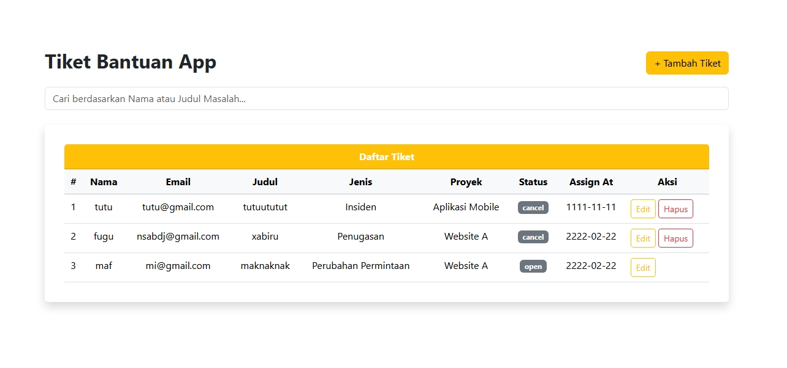
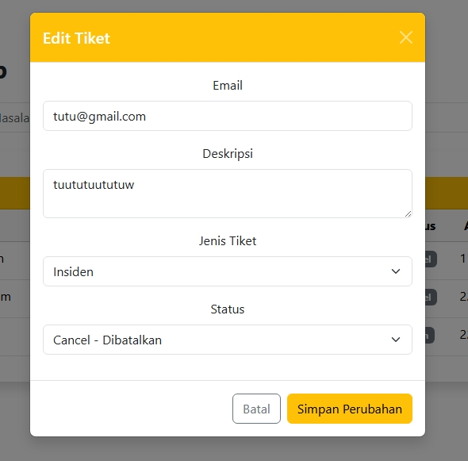
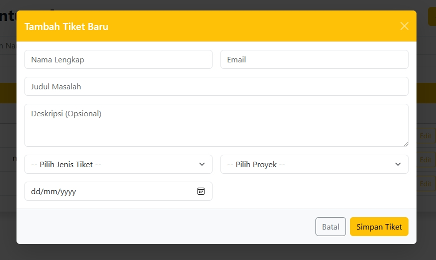
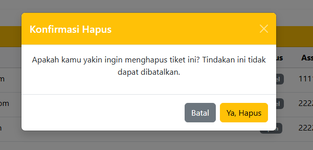

# 🎫 Aplikasi Tiket Bantuan

Aplikasi ini adalah sistem manajemen tiket bantuan berbasis React, Bootstrap, dan API backend (Lumen). Digunakan untuk membuat, melihat, mengedit, dan menghapus tiket bantuan teknis.

## 📌 Fitur

- Menampilkan daftar tiket dalam bentuk tabel
- Form tambah dan edit tiket dalam modal Bootstrap
- Pencarian tiket berdasarkan nama atau judul
- Tombol hapus muncul hanya untuk tiket dengan status `cancel`
- Validasi form sederhana
- Responsif dan mudah digunakan

## 📸 Screenshot

### Tampilan Daftar Tiket + Pencarian


### Modal untuk mengedit Tiket


### Modal untuk mengcreate Tiket


### Modal untuk mengkonfirmasi hapus



## 🚀 Cara Menjalankan

```bash
# Clone repository
git clone https://github.com/RestuLintangg/restu-ReactTiketProjekExorty.git

# Install dependencies
npm install

# Jalankan aplikasi
npm run dev
